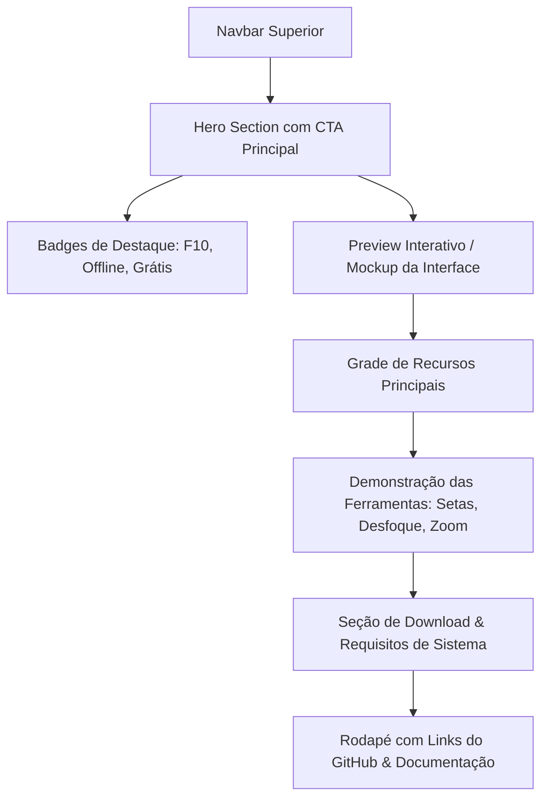

# 🌲 Guia de Criação do Website Oficial - DeerPrint 🦌

Este documento fornece as diretrizes completas de design, arquitetura, conteúdo e integração técnica para a criação de uma **Landing Page moderna e profissional** para o **DeerPrint**, com download direto do instalador hospedado no GitHub Releases.

---

## 🎯 1. Objetivo do Site

- **Apresentar o DeerPrint**: Destacar o aplicativo como uma ferramenta moderna, rápida e intuitiva para captura de tela em alta resolução e anotações técnicas de precisão no Windows.
- **Disponibilizar Download Direto**: Facilitar o download do instalador `.exe` (hospedado no GitHub) com detecção automática da versão mais recente.
- **Transmitir Credibilidade & Estilo**: Manter a identidade visual oficial **Sylvan Core** (*Midnight Forest & Pale Moss*), com alta elegância, contraste perfeito e estética premium.

---

## 🎨 2. Sistema de Design (Sylvan Core)

Para manter a consistência com o aplicativo desktop, utilize as seguintes variáveis de design:

### 🌈 Paleta de Cores Oficial

| Papel | Cor | Hex / RGBA | Uso |
| :--- | :--- | :--- | :--- |
| **Fundo Principal (Canvas)** | Midnight Forest Profundo | `#121412` | Fundo geral da página |
| **Fundo de Cartões / Superfícies** | Midnight Forest Base | `#181b18` | Cards de recursos, navbar, modais |
| **Superfície Elevada / Hover** | Forest Slate | `#232a21` | Hover de itens, inputs, containers |
| **Cor Primária (Destaque)** | Pale Moss (Verde Musgo) | `#b8cda7` | Botão principal de Download, badges, títulos |
| **Destaque Claro** | Soft Moss | `#d4e9c2` | Ícones, texto de realce, status ativo |
| **Texto Primário** | Crisp White / Bone | `#f0f3ed` | Títulos principais e textos de alto contraste |
| **Texto Secundário** | Moss Gray | `#a1a89c` | Descrições, parágrafos, subtítulos |
| **Bordas Sutis** | Forest Border | `rgba(184, 205, 167, 0.15)` | Linhas divisórias e contorno de cards |
| **Borda Ativa / Foco** | Active Moss Glow | `rgba(184, 205, 167, 0.45)` | Foco de botões e bordas destacadas |

### 🔤 Tipografia Recomendada
- **Títulos & Headings**: `Manrope` ou `Plus Jakarta Sans` (Google Fonts) — Pesos 700 e 800.
- **Corpo de Texto**: `Inter` — Pesos 400 e 500.
- **Teclas de Atalho & Código**: `JetBrains Mono` — Peso 600.

---

## 🔗 3. Como Gerar e Integrar os Links de Download do GitHub

O DeerPrint utiliza o GitHub Releases do repositório:
👉 `https://github.com/Fulviotanure/DeerPrint`

Existem **três métodos** para vincular o download do aplicativo no site:

---

### 🔹 Método A: Dinâmico via GitHub API (Mais Recomendado ⭐)

Este método busca a versão mais recente em tempo real através da API pública do GitHub, atualiza o texto do botão (ex: *"Baixar DeerPrint v3.0.5 para Windows"*) e direciona o clique diretamente para o arquivo `.exe`.

#### Código JavaScript para o Botão:
```javascript
// Script de Download Dinâmico do GitHub Releases
async function setupDownloadButton() {
  const repo = 'Fulviotanure/DeerPrint';
  const downloadBtn = document.getElementById('btn-download-hero');
  const versionBadge = document.getElementById('hero-version-tag');
  
  // Fallback padrão caso a API demore
  let downloadUrl = `https://github.com/${repo}/releases/latest`;

  try {
    const response = await fetch(`https://api.github.com/repos/${repo}/releases/latest`);
    if (response.ok) {
      const release = await response.json();
      const version = release.tag_name; // ex: "v3.0.5"
      
      // Procura o instalador .exe nos assets
      const exeAsset = release.assets.find(asset => 
        asset.name.endsWith('.exe') && !asset.name.includes('blockmap')
      );

      if (exeAsset) {
        downloadUrl = exeAsset.browser_download_url;
      }

      // Atualiza o texto e os links na página
      if (versionBadge) {
        versionBadge.textContent = `Versão ${version} • Windows 10/11`;
      }
      if (downloadBtn) {
        downloadBtn.href = downloadUrl;
        const btnText = downloadBtn.querySelector('.btn-label');
        if (btnText) btnText.textContent = `Baixar para Windows (${version})`;
      }
    }
  } catch (error) {
    console.warn('Erro ao consultar a API do GitHub Releases:', error);
    if (downloadBtn) downloadBtn.href = downloadUrl;
  }
}

document.addEventListener('DOMContentLoaded', setupDownloadButton);
```

---

### 🔹 Método B: Link Direto da Release Mais Recente

O GitHub possui um redirecionamento automático para a última versão lançada:
- **Página da última release**:
  `https://github.com/Fulviotanure/DeerPrint/releases/latest`
- **Todas as versões e histórico**:
  `https://github.com/Fulviotanure/DeerPrint/releases`

---

## 📐 4. Estrutura Recomendada da Landing Page



### Seções Detalhadas:

1. **Navbar**:
   - Logo do Cervo DeerPrint + Nome.
   - Links: *Recursos*, *Atalhos*, *Changelog*, *GitHub*.
   - Botão secundário de Download rápido.

2. **Hero Section (Topo)**:
   - **Badge de Novidade**: `🌿 Novo DeerPrint v3.0.5 Disponível`
   - **Título Principal**: *"Captura de tela rápida com anotações de precisão cirúrgica."*
   - **Subtítulo**: *"O DeerPrint combina atalhos instantâneos (F10), desenho inteligente que não interfere nos seus objetos, desfoque profissional e interface Sylvan Core para elevar seu fluxo de trabalho."*
   - **CTA Principal**: Botão verde musgo `[ ⬇️ Baixar Grátis para Windows ]` + Subtexto: *"Instalador oficial seguro • 64-bit • Gratuito"*.
   - **Mockup/Screenshot**: Imagem real do aplicativo aberta com anotações de exemplo.

3. **Grade de Recursos (Features)**:
   - ⚡ **Disparo Instantâneo**: Capture a tela inteira em milissegundos pressionando `F10`.
   - 🎯 **Precisão de Desenho**: Puxe setas, linhas e formas sobre outros objetos sem arrastar ou mover nada por engano.
   - 💧 **Desfoque e Privacidade**: Oculte senhas e dados confidenciais com desfoque gaussiano suave.
   - 📐 **Zoom & Pan Panorâmico**: Navegue em capturas 4K com roda do mouse e ajuste fino de pixels.
   - 🔄 **Atualizações Silenciosas**: O app verifica e aplica novas versões automaticamente em segundo plano.
   - 🔒 **100% Local e Privado**: Nenhum print sai da sua máquina sem sua permissão.

4. **Tabela de Atalhos Rápidos**:
   - `F10`: Disparar Captura de Tela
   - `Ctrl + C`: Copiar imagem com anotações para a Área de Transferência
   - `Ctrl + S`: Salvar Imagem em Alta Resolução
   - `Ctrl + Z / Ctrl + Y`: Desfazer / Refazer ilimitado
   - `Ctrl + Scroll`: Zoom in / Zoom out

5. **Footer**:
   - Links do repositório no GitHub, licença de código aberto e créditos de desenvolvimento.

---

## 💻 5. Exemplo Completo de Landing Page (HTML + CSS + JS)

Você pode usar o template abaixo como base para hospedar no **GitHub Pages**, **Vercel** ou **Netlify**:

```html
<!DOCTYPE html>
<html lang="pt-BR">
<head>
  <meta charset="UTF-8">
  <meta name="viewport" content="width=device-width, initial-scale=1.0">
  <title>DeerPrint - Capturas de Tela de Alta Precisão para Windows</title>
  <link rel="preconnect" href="https://fonts.googleapis.com">
  <link rel="preconnect" href="https://fonts.gstatic.com" crossorigin>
  <link href="https://fonts.googleapis.com/css2?family=Inter:wght@400;500;600&family=Manrope:wght@700;800&family=JetBrains+Mono:wght@600&display=swap" rel="stylesheet">
  <style>
    :root {
      --bg-dark: #121412;
      --bg-card: #181b18;
      --bg-card-hover: #232a21;
      --primary: #b8cda7;
      --primary-light: #d4e9c2;
      --primary-dark: #181b18;
      --text-main: #f0f3ed;
      --text-muted: #a1a89c;
      --border: rgba(184, 205, 167, 0.15);
      --border-active: rgba(184, 205, 167, 0.4);
    }

    * { box-sizing: border-box; margin: 0; padding: 0; }
    body {
      font-family: 'Inter', sans-serif;
      background-color: var(--bg-dark);
      color: var(--text-main);
      line-height: 1.6;
      overflow-x: hidden;
    }

    /* Navbar */
    .navbar {
      display: flex;
      align-items: center;
      justify-content: space-between;
      padding: 18px 48px;
      border-bottom: 1px solid var(--border);
      background: rgba(18, 20, 18, 0.85);
      backdrop-filter: blur(16px);
      position: sticky;
      top: 0;
      z-index: 100;
    }
    .brand {
      display: flex;
      align-items: center;
      gap: 12px;
      font-family: 'Manrope', sans-serif;
      font-weight: 800;
      font-size: 20px;
      color: var(--text-main);
      text-decoration: none;
    }
    .brand-logo { width: 34px; height: 34px; border-radius: 6px; }

    /* Hero */
    .hero {
      padding: 90px 24px 60px;
      text-align: center;
      max-width: 900px;
      margin: 0 auto;
    }
    .tag-badge {
      display: inline-flex;
      align-items: center;
      gap: 8px;
      padding: 6px 14px;
      border-radius: 9999px;
      background: rgba(184, 205, 167, 0.12);
      border: 1px solid var(--border-active);
      color: var(--primary-light);
      font-size: 13px;
      font-weight: 600;
      margin-bottom: 24px;
    }
    .hero h1 {
      font-family: 'Manrope', sans-serif;
      font-size: clamp(36px, 6vw, 56px);
      font-weight: 800;
      line-height: 1.15;
      margin-bottom: 20px;
      letter-spacing: -0.5px;
    }
    .hero h1 span { color: var(--primary); }
    .hero p {
      font-size: 18px;
      color: var(--text-muted);
      max-width: 680px;
      margin: 0 auto 36px;
    }

    /* Buttons */
    .btn-download {
      display: inline-flex;
      align-items: center;
      gap: 12px;
      background: var(--primary);
      color: var(--primary-dark);
      padding: 16px 36px;
      font-size: 16px;
      font-weight: 700;
      text-decoration: none;
      border-radius: 8px;
      transition: all 0.2s ease;
      box-shadow: 0 4px 20px rgba(184, 205, 167, 0.25);
    }
    .btn-download:hover {
      background: var(--primary-light);
      transform: translateY(-2px);
      box-shadow: 0 8px 30px rgba(184, 205, 167, 0.4);
    }
    .download-meta {
      display: block;
      margin-top: 10px;
      font-size: 13px;
      color: var(--text-muted);
    }

    /* Features */
    .features {
      max-width: 1100px;
      margin: 80px auto;
      padding: 0 24px;
      display: grid;
      grid-template-columns: repeat(auto-fit, minmax(300px, 1fr));
      gap: 24px;
    }
    .feature-card {
      background: var(--bg-card);
      border: 1px solid var(--border);
      padding: 32px 24px;
      border-radius: 12px;
      transition: all 0.2s ease;
    }
    .feature-card:hover {
      background: var(--bg-card-hover);
      border-color: var(--border-active);
      transform: translateY(-3px);
    }
    .feature-icon {
      font-size: 28px;
      margin-bottom: 16px;
      display: inline-block;
    }
    .feature-card h3 {
      font-family: 'Manrope', sans-serif;
      font-size: 18px;
      font-weight: 700;
      margin-bottom: 8px;
    }
    .feature-card p {
      font-size: 14px;
      color: var(--text-muted);
    }

    /* Footer */
    footer {
      border-top: 1px solid var(--border);
      padding: 40px 24px;
      text-align: center;
      font-size: 14px;
      color: var(--text-muted);
    }
    footer a { color: var(--primary); text-decoration: none; }
  </style>
</head>
<body>

  <!-- Navbar -->
  <nav class="navbar">
    <a href="#" class="brand">
      
      <span>DeerPrint</span>
    </a>
    <a href="https://github.com/Fulviotanure/DeerPrint" target="_blank" style="color: var(--text-muted); text-decoration: none; font-size: 14px;">GitHub ↗</a>
  </nav>

  <!-- Hero Section -->
  <header class="hero">
    <div class="tag-badge">🦌 Sistema Sylvan Core • v3.0.5 Disponível</div>
    <h1>Captura de tela rápida com <span>precisão cirúrgica</span>.</h1>
    <p>A ferramenta de screenshots definitiva para Windows com atalho F10, ferramentas de desenho inteligentes e atualizações automáticas.</p>
    
    <a id="btn-download-hero" href="https://github.com/Fulviotanure/DeerPrint/releases/latest" class="btn-download">
      <svg width="20" height="20" viewBox="0 0 24 24" fill="none" stroke="currentColor" stroke-width="2.5"><path d="M21 15v4a2 2 0 0 1-2 2H5a2 2 0 0 1-2-2v-4"></path><polyline points="7 10 12 15 17 10"></polyline><line x1="12" y1="15" x2="12" y2="3"></line></svg>
      <span class="btn-label">Baixar para Windows</span>
    </a>
    <span id="hero-version-tag" class="download-meta">Windows 10/11 (64-bit) • Gratuito & Aberto</span>
  </header>

  <!-- Recursos Grid -->
  <section class="features">
    <div class="feature-card">
      <div class="feature-icon">⌨️</div>
      <h3>Disparo com F10</h3>
      <p>Capture sua tela inteira ou região instantaneamente com a tecla de atalho padrão ou personalize nas configurações.</p>
    </div>
    <div class="feature-card">
      <div class="feature-icon">🏹</div>
      <h3>Desenho sem Conflito</h3>
      <p>Puxe setas e formas a partir de qualquer ponto sem selecionar ou mover elementos existentes por engano.</p>
    </div>
    <div class="feature-card">
      <div class="feature-icon">💧</div>
      <h3>Desfoque de Privacidade</h3>
      <p>Oculte senhas, emails e dados confidenciais com efeito de vidro fosco antes de compartilhar.</p>
    </div>
  </section>

  <footer>
    <p>DeerPrint © 2026 • Desenvolvido por <a href="https://github.com/Fulviotanure" target="_blank">Fúlvio Tanure</a> • Código aberto no <a href="https://github.com/Fulviotanure/DeerPrint" target="_blank">GitHub</a></p>
  </footer>

  <script>
    // Conexão direta com a API do GitHub Releases
    async function initReleaseInfo() {
      const repo = 'Fulviotanure/DeerPrint';
      try {
        const res = await fetch(`https://api.github.com/repos/${repo}/releases/latest`);
        if (res.ok) {
          const data = await res.json();
          const exe = data.assets.find(a => a.name.endsWith('.exe') && !a.name.includes('blockmap'));
          if (exe) {
            document.getElementById('btn-download-hero').href = exe.browser_download_url;
            document.getElementById('hero-version-tag').textContent = `Versão ${data.tag_name} • Windows 10/11 (64-bit)`;
          }
        }
      } catch(e) {
        console.warn('Fallback para link da release:', e);
      }
    }
    document.addEventListener('DOMContentLoaded', initReleaseInfo);
  </script>
</body>
</html>
```

---

## 🚀 6. Onde Hospedar Gratuitamente
1. **GitHub Pages (Mais Simples)**:
   - Crie uma branch `gh-pages` ou ative o GitHub Pages nas configurações do repositório apontando para uma pasta `docs/`.
2. **Vercel / Netlify**:
   - Conecte ao repositório `Fulviotanure/DeerPrint` e aponte para o arquivo `index.html`. O deploy é instantâneo e com SSL automático.
